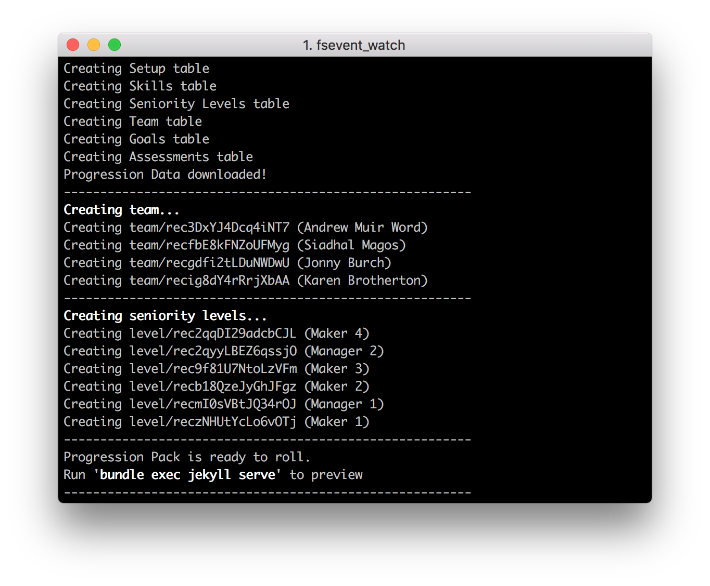

## Progression Pack templates

This repository is a companion to [Progression Pack](https://progressionpack.com).

To use these for your team's progression framework, follow the below instructions.

---

# One minute setup

Got your Airtable access, a Github account and looking to just get going quickly? Try this simple three step setup using [Netlify](https://netlify.com).


### 1. First of all grab your Airtable App Key and API key. 

These can be found by doing the following:

1. Open your personal Progression Pack Airtable base
2. Open your `Account` Settings, and under `API` generate a new API key.
2. Next, click `help` then `API Documentation`
3. Scroll to `Authentication` and find the 'Query Parameter' (it should look like `https://api.airtable.com/v0/app12345/Foo?api_key=key12345`)
4. Your App ID is the part from with `app` until before the `/` and the API key is the part beginning with `key` at the end.

_Important: Keep these safe and private, but close to hand. Anyone with these can view and modify your data. You can also create a second Airtable user with read-only access and use their APP_KEY if you want to be extra safe._


### 2. Fork the repository and add to Netlify.

First click the 'Fork' button on this repository in Github to create your own version of it.

Then head to <a href="https://netlify.com">Netlify</a>. Follow the instructions on Netlify to create a new repository in your Github account and deploy your first version.

1. You'll connect your Github account
2. Netlify will ask you to name your repository. Click 'advanced options' to enter the details you found in the previous step into two 'Environment Variables'.

```
APP_ID: [Your Airtable base ID]
APP_KEY: [Your Airtable api key]
```

When you've completed this step, your deploy should begin! The domain name will be random, but you can update to your own when you see fit.

### 3. Edit your brand colour

If you head to your Github account you'll also see a new repository. You'll need this to run Progression Pack locally and make any styling changes.

If all you want to do is add your brand colour, you can do that from within Github. Just head to 
```
/blob/master/_sass/_variables.scss
``` 
and edit the `$color-brand` variable to your brand colour. You can also make decisions about the colours of other UI elements towards the bottom of that file.

When you commit that file, Netlify will automatically push the changes to your live site.


---

# Running Locally

### System Requirements
- Ruby [Install](https://jekyllrb.com/docs/installation/macos/)
- Python3 [Install](https://realpython.com/installing-python/#macos-mac-os-x)

### Step 1. Download the repository, install dependencies and pull the data

_If you've not used git before, you may want to enlist the help of someone else for this part._

1. Open Terminal.
2. These templates use the Jekyll static site generator. Follow the [instructions to install Jekyll](https://jekyllrb.com/) (You may have to [install Ruby and RubyGems too](https://jekyllrb.com/docs/installation/) if you haven't done so before).
3. Once Jekyll is installed, navigate to your progression-pack repository.
```
cd path/to/your/progression-pack
```
4. run `pip3 install -r requirements.txt` to install python requirements _(You'll need [python3](https://realpython.com/installing-python/#macos-mac-os-x) installed for this command to work._
5. In terminal, run the command 
```
export APP_ID=yourappid && export APP_KEY=yourappkey
```
(replacing with your own details). This will add these to your current terminal session, so you'll need to rerun in any new windows or sessions.

### Step 2. Run Jekyll

1. run `make serve` to run Jekyll locally. You can navigate to [http://localhost:4000](http://localhost:4000) to see it in action.
2. When you're happy you can build a production version in your `_site/` folder with `make build`.

---

# Hiding links to team members

 

You can get the obscure links to team members to share how you wish by looking in terminal (or in the Netlify deploy output). (By default they will be the links starting with `/team/`)

The Progression Pack UI also by default shows links to team members, including skills. If you'd like to obscure personal information between team members, it's easy to do. 

Just go into `netlify.toml` and change the line 
```
command = "make build"`
```
to
```
command = "make build-teamsafe"
```
Then save and commit-push to Github. Your next build will have removed any links to team members.

The same also works locally. Just run `make serve-teamsafe` or `make build-teamsafe` to test.

_If running locally, remember to also change your jekyll serve command accordingly_

---

# Updating the Netlify site automatically every few minutes with a cronjob

1. Create a build hook from within the Netlify interface. 
2. Go to [Easycron](https://www.easycron.com) and create a free account.
3. Taking the URL from the build hook above, click 'create new cronjob' and paste it in the URL box. Choose an interval in the `When to Execute` box (Perhaps every 10 minutes)
4. In the `Identifier` tab, give the cronjob a sensible name, and in the `Method and Headers` tab change the method to `POST`.
5. Click `Create Cron Job` and you're done! You can test it by clicking the conical beaker icon. (You'll know it worked if the website starts building in Netlify)

_If you want to deploy more often than every 20 minutes you'll need to pay all of $12 for a year of the next tier of Easycron. This cronjob can alternatively be run with Zapier or various other services_


---

# Password protect your site

There is no auth built into this site - it's static content so hard to secure reliably. 

You should look to wherever you're hosting the site to provide the level of auth you need (For example, password protecting the entire site or specific pages, using oAuth to allow your Google Apps users access).

If you're using the Netlify hosting, they provide password protection and basic Auth on their [Team Pro](https://www.netlify.com/pricing/#teams) plan, at $45/month.


---

### License

<a rel="license" href="http://creativecommons.org/licenses/by-nc-sa/4.0/"></a><br />This work is licensed under a <a rel="license" href="http://creativecommons.org/licenses/by-nc-sa/4.0/">Creative Commons Attribution-NonCommercial-ShareAlike 4.0 International License</a>.