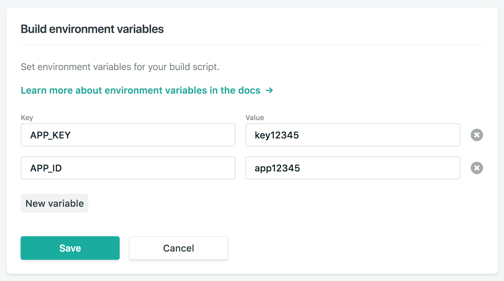

## Progression Pack templates

This repository is a companion to [Progression Pack](https://progressionpack.com).

To use these for your team's progression framework, follow the below instructions.

---

# One minute setup

Got your Airtable access, a Github account and looking to just get going quickly? Try this simple three step setup using [Netlify](https://netlify.com).


#### 1. First of all grab your Airtable App Key and API key. 

These can be found by doing the following:

1. Open your personal Progression Pack Airtable base
2. Click `help` then `API Documentation`
3. Click `Show API Key` in the top right of the dark panel, then scroll to `Authentication` and find the 'Query Parameter' (it should look like `https://api.airtable.com/v0/app12345/Foo?api_key=key12345`)
4. Your App ID is the part from with `app` until before the `/` and the API key is the part beginning with `key` at the end.

_Important: Keep these safe and private, but close to hand. Anyone with these can view and modify your data. You can also create a second Airtable user with read-only access and use their APP_KEY if you want to be extra safe._


#### 2. Hit this link: [Deploy to Netlify](https://app.netlify.com/start/deploy?repository=https://github.com/jonnyburch/progressionpack-static) 

Follow the instructions on Netlify to create a new repository in your Github account and deploy your first version.

[](https://app.netlify.com/start/deploy?repository=https://github.com/jonnyburch/progressionpack-static)

**This deploy will fail. That's expected - you need to complete the next step for a successful deploy**


#### 3. Finally, there are two things you'll need to do within Netlify's interface:

1. Add your personal API Key and App ID as environment variables
2. (optional) Update the domain URL to something memorable (or add your own custom domain).



This should mean your next deploy pulls in your own Progression Pack data and sends it to your personal domain.

_scroll to the bottom for instructions for hiding team members' skills from each other, and setting a cronjob to deploy automatically every few minutes._

---

# Running Locally

### System Requirements
- Ruby [Install](https://jekyllrb.com/docs/installation/macos/)
- Python3 [Install](https://realpython.com/installing-python/#macos-mac-os-x)

### Step 1. Download the repository, install dependencies and pull the data

_If you've not used git before, you may want to enlist the help of someone else for this part._

1. Open Terminal.
2. These templates use the Jekyll static site generator. Follow the [instructions to install Jekyll](https://jekyllrb.com/) (You may have to [install Ruby and RubyGems too](https://jekyllrb.com/docs/installation/) if you haven't done so before).
3. Once Jekyll is installed, navigate to your progression-pack repository.
```
cd path/to/your/progression-pack
```
4. run `pip3 install -r requirements.txt` to install python requirements _(You'll need [python3](https://realpython.com/installing-python/#macos-mac-os-x) installed for this command to work._
5. In terminal, run the command `export APP_ID=yourappid && export APP_KEY=yourappkey` (replacing with your own details). This will add these to your current terminal session, so you'll need to rerun in any new windows or sessions.
6. run `make pp` to create your team and level pages.


### Step 2. Run Jekyll

1. run `JEKYLL_ENV=production jekyll serve` to run Jekyll locally. You can navigate to [http://localhost:4000](http://localhost:4000) to see it in action.
2. When you're happy you can build a production version in your `_site/` folder with `JEKYLL_ENV=production jekyll build`.

---

# Hiding links to team members

 

You can get the obscure links to team members to share how you wish by looking in terminal (or in the Netlify deploy output). (By default they will be the links starting with `/team/`)

The Progression Pack UI also by default shows links to team members, including skills. If you'd like to obscure personal information between team members, it's easy to do. 

Just go into `netlify.toml` and change the line 
```
command = "make pp && JEKYLL_ENV=production jekyll build"`
```
to
```
command = "make pp && JEKYLL_ENV=teamsafe jekyll build"
```
Then save and commit-push to Github. Your next build will have removed any links to team members.

_If running locally, remember to also change your jekyll serve command accordingly_

---

# Updating the Netlify site automatically every few minutes with a cronjob

1. Create a build hook from within the Netlify interface. 
2. Go to [Easycron](https://www.easycron.com) and create a free account.
3. Taking the URL from the build hook above, click 'create new cronjob' and paste it in the URL box. Choose an interval in the `When to Execute` box (Perhaps every 10 minutes)
4. In the `Identifier` tab, give the cronjob a sensible name, and in the `Method and Headers` tab change the method to `POST`.
5. Click `Create Cron Job` and you're done! You can test it by clicking the conical beaker icon. (You'll know it worked if the website starts building in Netlify)

_If you want to deploy more often than every 20 minutes you'll need to pay all of $12 for a year of the next tier of Easycron. This cronjob can alternatively be run with Zapier or various other services_


---

### License

<a rel="license" href="http://creativecommons.org/licenses/by-nc-sa/4.0/"></a><br />This work is licensed under a <a rel="license" href="http://creativecommons.org/licenses/by-nc-sa/4.0/">Creative Commons Attribution-NonCommercial-ShareAlike 4.0 International License</a>.